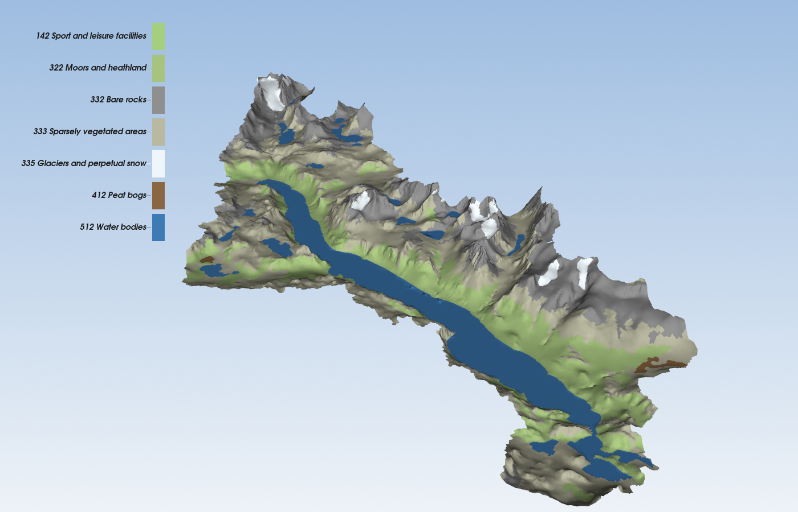

# Rasputin

Rasputin turns a digital elevation model (DEM) into a triangulated irregular
network (TIN): a triangle mesh of the terrain that uses few triangles where the
ground is smooth and many where it is rough, and never strays from the DEM by
more than a height tolerance you choose.



*The Bygdin catchment (305 km²) at a 10 m tolerance, each triangle coloured by
its CORINE land-cover class. Elevation © Kartverket (CC BY 4.0); land cover
© European Union, Copernicus Land Monitoring Service 2018, EEA. How it was made:
`docs/benchmarks/2026-09-29/bygdin-landcover.md`.*

## What it does

- **DEM in, mesh out.** One GeoTIFF, several, or a directory of tiles
  (Kartverket's DTM10, for example), stitched into one grid.
- **A domain.** Mesh only the inside of a polygon, such as a catchment
  (GeoJSON or WKT, in any CRS that pyproj reads).
- **Features as constraints.** Lakes, land-cover borders, roads and rivers
  (GeoJSON, GeoPackage or GML) become edges of the mesh, so no triangle
  crosses them.
- **Land-cover labels.** With a CORINE class map, every triangle gets the class
  of the polygon it lies in.
- **Refinement to a tolerance.** Triangles are split at the worst DEM point
  until every triangle is within `--tolerance` metres of the DEM, then kept
  Delaunay, with a minimum-angle start so there are no slivers along the
  boundary.
- **Auto-catchment.** `rasputin catchment` computes the catchment of a lake
  from the DEM (a `--seed` point in the lake) and writes it as a GeoJSON
  polygon, reduced to `--outline-tolerance` with its area kept, ready for
  `--domain`.

## Quick example

Install first ([INSTALL.md](INSTALL.md)); the example needs the `codecs`
extra, because the committed DEM tile is LZW-compressed. The install is
bounds-checked by default; INSTALL.md's "Bounds checks" section says how to
build an unchecked copy for heavy runs. From the repository
root:

```sh
# A 50 km DTM10 tile, meshed inside a quarter disc of radius 30 km,
# to within 1 m of the DEM.
rasputin mesh \
    --dem tests/fixtures/dem_archive/7908_3_10m_z33.tif \
    --domain docs/benchmarks/2026-09-26/quarter.geojson \
    --tolerance 1 \
    --out quarter.vtk

# The same, with CORINE land cover as constraints and labels,
# at a 5 m tolerance.
rasputin mesh \
    --dem tests/fixtures/dem_archive/7908_3_10m_z33.tif \
    --domain docs/benchmarks/2026-09-26/quarter.geojson \
    --features tests/fixtures/corine/clc2018_7908_3.gpkg --features-map corine \
    --tolerance 5 \
    --out quarter_landcover.vtk

# Natural colours for the land-cover classes, for ParaView.
rasputin palette corine --out corine.json
```

The first command writes about 430,000 triangles in under two seconds on a
laptop (Apple M1 Max). Add `--stats -` to print sizes, mesh quality and timings.

`rasputin --help` lists the commands, and `rasputin mesh --help` explains
every option.

## Output and viewing

- **`.vtk`** (legacy VTK, one file) is for [ParaView](https://www.paraview.org).
  It holds the triangles, the constraint edges with their feature bits and,
  with a class map, the cell array `land_cover_code`. To colour by land cover,
  import `corine.json` in ParaView's Colour Map Editor (Choose Preset, Import)
  and colour by `land_cover_code`.
- **`.ply`** is for QGIS and other mesh tools. The surface goes to `--out`,
  and the constraint edges, if you want them, to a second file named by
  `--out-edges`.

Both formats are text by default; `--binary` writes packed records.

## How it is built

- **A C++20 core** (`include/terrain/`, `src/`): exact geometric predicates,
  a constrained Delaunay triangulation, a noder that makes input lines meet
  cleanly, and the parallel refinement. The core never opens a file and knows
  nothing about coordinate systems. The only third-party C++ code is
  [detria](https://github.com/Kimbatt/detria), vendored in `lib/detria/`.
- **A Python layer** (`src_python/tin_engine/`): reading GeoTIFFs (tifffile),
  vector files and CRS (shapely, pyproj), configuration (Pydantic) and the CLI
  (Typer). The two meet through a pybind11 module, `tin_engine._core`.

`project_structure.md` describes the layout and the rules between the layers.

## Where to read more

- [INSTALL.md](INSTALL.md): installing, testing, and getting data.
- [ROADMAP.md](ROADMAP.md): what has been built and what comes next.
- [docs/increments/](docs/increments/): one design record per step of the
  work, with its measurements.

## Publications

Bhattarai, B. C., Silantyeva, O., Teweldebrhan, A. T., Helset, S., Skavhaug,
O., and Burkhart, J. F.: Impact of Catchment Discretization and Imputed
Radiation on Model Response: A Case Study from Central Himalayan Catchment,
Water, 12, 2020. https://doi.org/10.3390/w12092339

Silantyeva, O., Skavhaug, O., Bhattarai, B. C., Helset, S., Tallaksen, L. M.,
Nordaas, M., and Burkhart, J. F.: Shyft and Rasputin: a toolbox for hydrologic
simulations on triangular irregular networks. https://doi.org/10.31223/X5CS95

## Licence

MIT; see [LICENSE](LICENSE). Third-party code and data credits are in
[NOTICE.md](NOTICE.md). Rasputin is developed by Expert Analytics.
